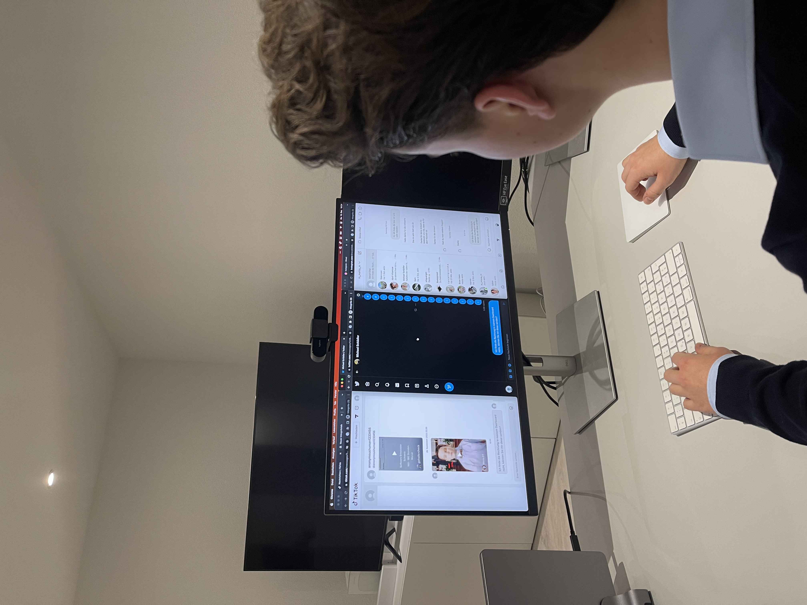
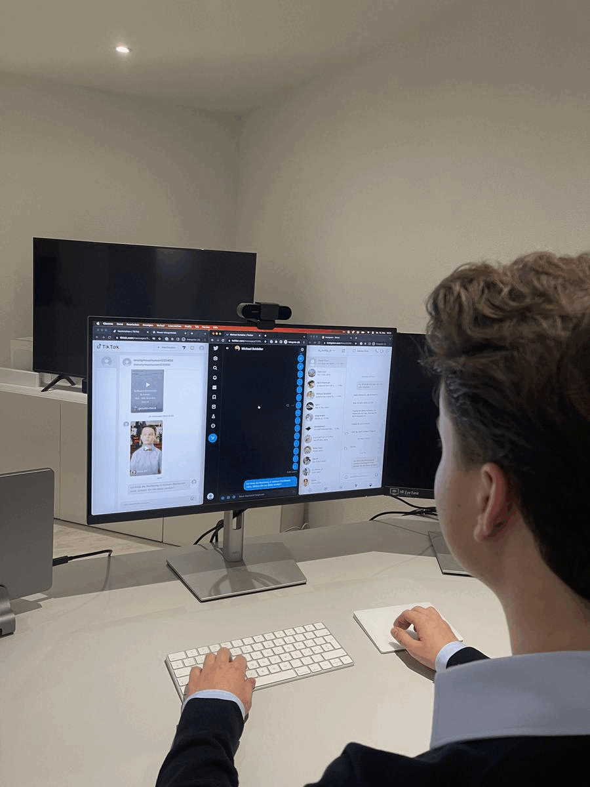

# Dokumentation ePortfolio

## Inhaltsverzeichnis

- [Inhaltsverzeichnis](#inhaltsverzeichnis)
- [Einleitung](#einleitung)
- [Aufgabenstellung](#aufgabenstellung)
- [Verwendete Tools, Techniken und Hilfsmittel](#verwendete-tools-techniken-und-hilfsmittel)
- [Multimediaelemente (Bilder, Logo und Video)](#multimediaelemente--bilder-logo-und-video-)
    - [Wie und wo wurden die jeweiligen Multimediaelemente erstellt?](#wie-und-wo-wurden-die-jeweiligen-multimediaelemente-erstellt)
    - [Beschreibung und Reflexion der Bearbeitung](#beschreibung-und-reflexion-der-bearbeitung)
- [Webseite](#webseite)
    - [Eingesetzte Technik und Erfahrungen](#eingesetzte-technik-und-erfahrungen-bei-der-webseite)
    - [Probleme, Herausforderungen und Lösungen](#probleme-herausforderungen-und-lösungen-bei-der-webseite)
      - [Start-Probleme](#start-probleme)
      - [Video-Einbindung](#video-einbindung)
      - [Formular](#formular)
      - [Footer](#footer)
      - [Design](#design)
      - [Navigation](#navigation)
      - [Step-Navigation](#step-navigation)
      - [Responsive](#responsive)
      - [Konsole-Fehler](#konsole-fehler)
- [Video](#video)
  - [Eingesetzte Technik und Erfahrungen beim Video](#eingesetzte-technik-und-erfahrungen-beim-video)
  - [Probleme, Herausforderungen und Lösungen beim Video](#probleme-herausforderungen-und-lösungen-beim-video)
    - [Allgemeine Probleme](#allgemeine-probleme)
    - [Technische Probleme](#technische-probleme)
- [Bilder](#bilder)
  - [Bildbearbeitung](#bildbearbeitung)
    - [1. Bild](#1-bild)
    - [2. Bild](#2-bild)
    - [3. Bild](#3-bild)
  - [Probleme, Herausforderungen und Lösungen bei den Bildern](#probleme-herausforderungen-und-lösungen-bei-den-bildern)
- [Gesamtreflexion / Fazit](#gesamtreflexion--fazit)

## Einleitung

## Aufgabenstellung

Es geht darum, ein ePortfolio zu erstellen das diverse Multimedia-Elemente zu einem Produkt zusammenfasst zu erstellen. Hierfür soll zu einem im Voraus bestimmtes Thema eine Webseite erstellt werden in der mind. 3 Bildmanipulationen vorkommen, sowie ein Logo und ein Video das bearbeitet wurde. Dies muss genau dokumentiert werden.

## Verwendete Tools, Techniken und Hilfsmittel

Ich habe ein leeres HTML-Projekt genommen, hierfür habe ich aber Tailwind als Style-Library hinzugefügt und AlpineJS als JavaScript-Library. Um das Web-Package zu generieren habe ich Vite benutzt, welches sehr schnell im generieren eines Web-Package ist. ==...== Für die Multimediabearbeitung habe ich mich für Affinity Photo und Affinity Designer entschieden, da ich beide schon kannte und eine Lizenz dafür hatte. Da ich diese Programme schon kannte, konnte ich damit gut umgehen. Für die Entwicklungsumgebung selbst habe ich mich anfangs für Visual Studio Code und später für Goland entschieden. Der Grund warum ich gewechselt habe war, dass ich Goland angefangen habe zu verwenden da ich sonst viel in Go programmiere und mich an die IDE gewöhnt habe. Vor allem finde ich die benutzung von Git deutlich angenehmer in Goland als in Visual Studio Code.  Um den Emailing-Service zu deployen habe ich mich während der Entwicklung für Docker entschieden, welche ich später auf einer von mir gehosteten Node deployt habe.

## Multimediaelemente (Bilder, Logo und Video)

### Wie und wo wurden die jeweiligen Multimediaelemente erstellt?

Die Multimedia-Elemente wurden in verschiedenen Programmen erstellt. Die Videobearbeitung wurde in ==XXX== gemacht. Für Fotobearbeitung habe ich mich für Affinity Photo entschieden, da ich dieses Programm schon länger habe und ich mittlerweile auch damit umgehen kann. Ich habe mich auch dafür entschieden, da es eine günstige und trotzdem sehr gute Alternative zu Photoshop ist. Bei der Logo-Erstellung habe ich Affinity Designer benutzt, da man mit diesem Programm auch SVG-Dateien erstellen kann und ich wie schon bei dem Bildbearbeitungsprogramme dieses schon kannte und dieselben Argumente dafür habe.

### Beschreibung und Reflexion der Bearbeitung

## Webseite

### Eingesetzte Technik und Erfahrungen bei der Webseite

Hierfür habe ich mich für eine normale HTML-Seite entschieden welche in NodeJS läuft. Diese habe ich mit Tailwind als Style-Library und AlpineJS als JavaScript-Library aufgewertet. Für die Icons habe ich das Awesome-Font-Package in der kostenlosen Version hinzugefügt. Um das Package zu generieren habe ich Vite in das Projekt hinzugefügt. Tailwind hat den Vorteil dass es nur diese CSS-Klassen exportiert, die auch benötigt werden, das hilft der Webseiten Grösse und somit auch der Geschwindigkeit der Webseite. Für Vite habe ich mich entschieden, da es sehr schnell ist in Webpackages zu generieren und ich es schon länger mal ausprobieren wollte, da ich schon viel davon gehört habe.

### Probleme, Herausforderungen und Lösungen bei der Webseite

#### Start-Probleme

Ich hatte diverse Probleme, zum Beispiel kannte ich die wenigsten Technologien, die ich benutzt habe. Im Betrieb und Privat arbeite ich normalerweise im Backend-Bereich, wodurch ich teilweise mühe mit den Technologien hatte, da ich diese nicht kannte. Ich wollte aber nicht einfach eine HTML-Seite mit eigenem CSS und jQuery, darum habe ich mich mit den verschiedenen Technologien auseinandergesetzt. Nach längerem informieren und nach Gesprächen mit Timo Kluser habe ich mich für diese Projekt-Struktur entschieden. Bei welcher mir Timo auch Tipps gegeben und bei der Aufsetzung des Projektes geholfen hat.

#### Video-Einbindung

Da ich das Video über Youtube einbinden wollte, da es eine Vorgabe war und ich die Performance des Hosting nicht kannte, versuchte ich es einzubinden. Hier wurde mir das Video aber nie angezeigt, nur eine Meldung von YouTube, dass ein Fehler bei der Einbindung aufgetreten ist. Nach vielem und langen Probieren merkte ich, dass man bei den Video-Einstellungen in YouTube anwählen muss, dass es über ein iFrame eingebettet werden darf.

#### Formular

Das Formular konnte ich Grafisch relativ schnell erstellen. Jedoch stellte sich noch die Frage wie ich die E-Mails versenden kann, da ich kein PHP zur verfügung hatte. Hierfür habe ich nach verschiedenen Möglichkeiten gesucht und bin unter anderem auf "Netlify Forms" oder "Web3Forms" gestossen. Da es aber Preislich zu teuer war oder nicht so einbinden konnte wie ich das wollte habe ich mich für ein eigenen Service entschieden. Diesen habe ich in Go programmiert, da es meine Beruflich und Private Haupt-Programmiersprache ist. Hier kann ich als Administrator des Services eine Applikation erfassen. Nach dem erfassen wird mir ein Token generiert und zurückgegeben, welcher ich im JavaScript abspeichern konnte. So musste ich keine E-Mail-Anmeldedaten im JavaScript speichern, da dies sonst eine Sicherheitslücke wäre. Wenn jetzt der Endbenutzer das Formular übermittelt wird einen Request an den Service gesendet welcher das E-Mail versendet. Je nach Rückgabe-Status wird mir dann ein Modal angezeigt welches eine Erfolgsmeldung oder eine Fehlermeldung ausgibt.

Ein weiteres Problem, welches ich hatte, war, dass das Modal immer einen Fehler zurückgibt, da ich dieses Modal nicht asynchron aufgerufen habe. Dies war länger ein Problem, da ich es lange versuchte aber es nicht funktionierte. Die Lösung schlussendlich war, dass ich auf den Response wartete und erst nach erhalt des Responses die Meldung anzeigen liess.

Ein drittes Problem war, dass die Meldung nicht automatisch ausgeblendet wurde. Hier hat mich Timo Kluser nach langem suchen daruaf aufmerksam gemacht, dass ich die Timeout-Function nicht als normale Funkton haben darf sondern dass ein eine Arrow-Function daraus machen muss.

#### Footer

Beim Footer wusste ich nicht genau welche Daten ich alle darin speichern wollte. Das Problem war, dass ich zu wenige Informationen fand, welche in den Footer passten und dieser so ziemliche leer wirkte. Schlussendlich habe ich die Adresse, die Navigations und die Social-Media-Kanäle verlinkt. 

Wichtig ist, dass ich hier noch das Copyright eingefügt habe welches nicht im Prototyp war und ich dort vergessen habe. Ich habe es jetzt aber eingefügt, da es ein Kriterium ist.

#### Design

Beim Design hatte ich fast die meisten Probleme. Am Anfang sah es unstrukturiert aus, darum habe ich angefangen eine klare Linie zu halten. ==<Foto mit Linien einzeichnen und einfügen>== Dies wurde mir früher bei einem anderen Projekt von Michael Schädler empfohlen, damit es einheitlicher und strukturierter aussieht.

#### Navigation

Bei der Navigation hatte ich auch mehrere Probleme, zum einen wollte ich, dass es beim scrollen die Farbe ändert und zum anderen wollte ich ein Fullscreen Menü auf Mobile. Das erste Problem habe ich mittels JavaScript gelöst, hier habe ich ein Event-Listener welcher auf das Event 'Scroll' hört und dann überprüft, wo ich mich auf der Webseite befinde und je nachdem die Farb-Klassen auf der Navigation austauscht. Damit das Menü auf der Mobile-Version Fullscreen ist, habe ich ich ein Hamburger-Icon eingefügt, welches nur angezeigt wird, wenn der Bildschirm eine gewisse breite hat. Dies konnte ich mittels CSS-Media-Query beziehungsweise der Tailwind-Variante davon einstellen. Danach blende ich die Navigation in einer anderen Struktur ein, indem ich die Mobile-Navigations-Klassen mit JavaScript den Navigationselementen hinzufüge bei einem Klick auf den Hamburger. Hier hatte ich noch das Problem, dass ich ein Icon von Fontawesome benutzt habe und dieses abgerundet war und das eckige gekostet hätte. Darum hab ich noch lange nach einem alternativen gesucht und auch eines welches animiert ist, dann habe ich anstatt beim X-icon auch noch ein icon hinzuzufügen das selbst mit zwei Div-Containern gelöst und einer kleinen Animation dazwischen. Das Problem war noch die Farbe, wenn man ganz oben auf der Seite war, sollte der Hamburger und das X-Icon weiss sein. Wenn ich aber weiter nach unten geschellt bin, sollte das X-Icon weiterhin weiss sein und der Hamburger sollte dunkelblau sein.

Da ich im Header zuerst ein normales Bild hatte welche mittels JavaScript ausgetauscht wurde, damit das Bild auch während dem scrollen sichtbar bleibt, habe ich es durch ein SVG ersetzt. Das Problem zuerst war, dass ich das SVG nicht bearbeiten konnte, egal ob ich es Image-Tag, als Object-Tag oder sonst wie eingebunden habe. Darum habe ich mich schlussendlich dazu entschieden das SVG direkt ins HTML einzufügen, anstatt von einem externen File hineinzuladen. Danach funktionierte es und ich konnte je nach Scroll-Position die Farben der einzelnen Elemente ändern.

#### Step-Navigation

Hier hatte ich das Problem herauszufinden, in welcher aktuelle Sektion man sich befindet. Das habe ich gelöst, indem ich beim Event listener 'scroll' eine weitere Function aufrufe die, die verschiedenen Navigationen und deren Bildschirmkoordinaten aufruft und mit der aktuellen Scroll-Weite überprüft und je nach dem bei der aktuellen Kreis-Sektion eine weitere Klasse hinzufügt. Dann hatte ich noch das Problem, dass es erst sehr spät wechselt, hierzu habe ich noch mit der Bildschirmhöhe und dem Padding herumgespielt, welche im JavaScript im Vergleich mit eingerechnet werden.

#### Responsive

Die Mobile-Variante ging relativ schnell, jedoch hatte ich noch kleinere Probleme bei der Anordnung, z.B. wenn etwas auf der Desktop-Version nebeneinander war, sollte es jetzt untereinander sein. Hier musste ich noch dafür sorgen, dass das richtige Element zuerst kommt, zum Beispiel zuerst der Titel, dann der Text und zum Schluss das Bild. Hierfür musste ich viel mit der Flex-Direction den einzelnen Elementen Herumprobieren. Ein Problem dabei war auch, dass entweder die falsche Reihenfolge benutzt wurde, oder zum Beispiel beim Formular der Bestätigen-Button die ganze Reihe breit war. Das behob ich, indem ich nur die erste Reihe (Vorname und Nachname) die Flex-Direction änderte.

Nachdem ein grosser Teil der Webseite fertig war, hat mich Timo aufmerksam gemacht, dass es in Tailwind ein Element gibt, welches die Herkömmlichen Media-Queries ersetzt. Darum habe ich nach dem Mobile-First-Prinzip das komplette CSS umgebaut und die einzelne Tailwind-Media-Query-Alternative pro Element eingesetzt. Das war zwar ein wenig mühsam um es umzubauen, jedoch wurde das CSS deutlich lesbarer, schöner und kleiner.

#### Konsole-Fehler

Nach der Einbindung des Youtube-Videos wird von meinem Browser beziehungsweise meinem Adblock verschiedene Tracker des YouTube-Videos blockiert, hierfür werden Fehler in der Konsole verursacht, welche aber keinen Einfluss auf UI/UX haben. Diesen Fehler konnte ich auch nicht beheben, da dieser von dem Adblock verursacht wird und nicht von der Webseite selber.

## Video

### Eingesetzte Technik und Erfahrungen beim Video

Das Video habe ich mit DaVinci Resolve gemacht, da ich zuerst Adobe Premiere Pro und Adobe Premiere Rush ausprobiert habe, aber damit Probleme hatte. Für das Video habe ich zuerst einen kleinen Text aufgeschrieben, welche ich dann ins Mikrofon gesprochen haben. Danach habe ich bei den verschiedenen Themen die ich im Ton gesagt habe, das mit Bilder und Videos unterlegt. Zuerst hatte ich noch Videos, welche ich in echt gemacht habe, jedoch sieht es nicht so gut aus, darum habe ich mich später dazu entschieden die Videos auf dem Bildschirm aufzunehmen, anstatt spezielle Szenen in echt zu benutzen.

### Probleme, Herausforderungen und Lösungen beim Video

#### Allgemeine Probleme

Als estes fand ich es schwierig eine Video-Idee zu bekommen, darum habe ich als erstes geplant, dass ich ein Video über uns mache. Da wir aber kein grosses Team sind, oder sonst was speziell ist, war mir relativ schnell klar, dass es besser ist ein Video über uns SocialChat zu machen. Als ich ein paar Szenen in echt aufgenommen  habe, habe ich beim Schnitt gemerkt, dass es nicht so gut aussieht, da viel nicht so scharf war oder ein wenig verschwommen war. Darum habe ich mich später dazu entschieden Bildschirmaufnahmen zu verwenden.

#### Technische Probleme

Als ich auf der Plattform zu Demozwecken einen Instagram-Account verbinden wollte, hatte ich zuerst Probleme beim Verknüpfen des Facebooks Entwickleraccounts und des Instagramaccounts. Danach hatte ich, dass Problem, dass ich in Facebook eine App registrieren musste für SocialChat, und ich um diese App fertigzustellen einen verifizierten Entwickleraccount brauche und darum entweder Firmendokumente hochladen musste oder meinen Pass. Da ich das nicht wollte, habe ich es nicht verbunden, sondern im Video nur die Registration, Anmeldung und die Erstellung von Teams in SocialChat gezeigt. Twitter müsste man nicht über die Environment-Variablen des Images festsetzen, sondern man könnte sich anmelden, jedoch funktionierte das auch nicht.

Beim Schnitt hatte ich zuerst noch Probleme mit dem Schnittprogramm. Als Erstes habe ich Adobe Premiere Pro benutzt, hier konnte ich aber keine Bilder in Bilder verschieben, ich habe lange gegoogelt, jedoch hiess es da nur, mann kan das Bild anklicken, was bei mir nicht ging. Danach habe ich Adobe Premiere Rush ausprobiert, da ich dachte, ich brauche ja keine special effects, da sollte auch Rush reichen. Jedoch hatte ich das gleiche Problem wie bei der Pro Variante. Als Letztes habe ich DaVinci Resolve ausprobiert wo alles funktionierte. Im Nachhinein hätte ich auch iMovie benutzen können, da es gereicht hat, jedoch hatte ich am anfang die Vorstellung ich könnte ein sehr aufwändiges und mit special effects geschmücktes Video machen.

## Bilder

### Bildbearbeitung

#### 1. Bild

Das erste Bild ist ein Screenshot der Plattform. Da ich kein Messanger einbinden konnte, habe ich selbst eine Nachricht herein editiert, damit es aussieht als ob jemand darüber geschrieben hat. Dafür habe ich einen grauen Hintergrund eingefügt und dann die Eigenschaften der Person eingefügt. Die erste Eigenschaft ist ein Anonymes Profilbild, dann der Name, danach die Nachricht und zum schluss ein Element das darstellen soll, dass die Nachricht noch offen ist. Weiter habe ich die Ecken entfernt und den schwarzen Schatten unten entfernt.

<table>
  <tr>
    <th style="width: 33.3%;"> Original </th>
    <th style="width: 33.3%;"> Bearbeitung </th>
    <th style="width: 33.3%;"> Vergleich </th>
  </tr>
  <tr>
    <td style="width: 33.3%;">
      
    </td>
    <td style="width: 33.3%;">
      
    </td>
    <td style="width: 33.3%;">
      
    </td>
  </tr>
</table>

#### 2. Bild

Das zweite Bild ist eine Aufnahme, wie ich vor dem Bildschirm sitze und mehrere Chats pflege. Ich habe das gemacht, da mir von Michael Schädler gesagt wurde, dass es meistens authentischer wirkt, wenn Menschen auf dem Bild sind. Für die Bearbeitung habe ich einen Screenshot des Computers hinein editiert, damit man besser erkennen kann, dass ich verschiedene Chats offen habe. Danach habe ich auf dem Screenshot verschiedene Elementen wegeditiert. z.B. habe ich die anderen Konversationen und die bisherigen Chats unsichtbar gemacht. Weiter habe ich die Benutzernamen unkenntlich gemacht und ersetzt mit "SocialChat". Danach habe ich den Schatten der Kabel und des Bildschirmes auf dem Pult entfernt. Ebenso meine Muttermale. Als letztes habe ich den Fernseher und das Möbel entfernt uns stattdessen den Boden und die Wände erweitert. Da ich es zuerst im Hochformat hatte, musste ich das Bild noch ins Querformat bringen und habe dafür unten und oben etwas abgeschnitten.

<table>
  <tr>
    <th style="width: 33.3%;"> Original </th>
    <th style="width: 33.3%;"> Bearbeitung </th>
    <th style="width: 33.3%;"> Vergleich </th>
  </tr>
  <tr>
    <td style="width: 33.3%;">
      
    </td>
    <td style="width: 33.3%;">
      
    </td>
    <td style="width: 33.3%;">
      
    </td>
  </tr>
</table>

#### 3. Bild

<table>
  <tr>
    <th style="width: 33.3%;"> Original </th>
    <th style="width: 33.3%;"> Bearbeitung </th>
    <th style="width: 33.3%;"> Vergleich </th>
  </tr>
  <tr>
    <td style="width: 33.3%;">
      
    </td>
    <td style="width: 33.3%;">
      
    </td>
    <td style="width: 33.3%;">
      
    </td>
  </tr>
</table>

### Probleme, Herausforderungen und Lösungen bei den Bildern

Das grösste Problem war, dass ich nicht das Bild benutzen konnte, welches ich für das Storyboard benutzt habe, da es erstens das falsche Format hat und zweitens, auch wenn ich das Format angepasst habe es nicht wirklich auf die Webseite passte. Darum habe ich es nochmals neu gemacht.

## Reflexionen

### Bildmanipulation

Bei den Bildern hatte ich das Problem, dass ich es schwierig fand ein Bild zu machen, welches ich auch bearbeiten kann. Dafür habe ich beim Dashboard ein neues Element eingefügt. Das Bild, welches ich für das Storyboard gemacht habe, konnte ich leider nicht verwenden, darum habe ich noch ein neues gemacht, was nochmals ein wenig arbeit war, aber das neue sah auf der Webseite deutlich besser aus.

### Video

Ich fand es interessant, mal auch was anderes als nur programmieren zu machen. Als ich die Videos filmen musste, fand ich es aber über mein Thema schwierig, da es um eine Webapplikation geht. Beim Schnitt ist mir wieder aufgefallen, dass es schwierig ist, ein wirklich gutes Video zu schneiden über eine Plattform. Abschliessend kann ich sagen, ich fand es interessant ein Video zu schneiden, ich bin aber ehrlich gesagt auch froh, dass das nicht zu meiner Haupttätigkeit im Beruf gehört, da ich deutlich lieber und besser programmiere.

### Webseite

Die Webseite zu programmieren fand ich eine sehr coole aufgabe. Wir konnten unser eigenes Thema festlegen und bekamen nicht alles vorgeschrieben. Was auch gut war, war, dass wir die Technologien mehr oder weniger frei wählen konnten. Da ich normalerweise mehr Backend programmiere, fand ich es für mich persönlich gut um auch mal Frontend zu entwickelnd, da ich auch privat viele Ideen was ich programmieren könnte, aber meistens am Frontend scheitert. Ich habe daher auch versucht möglichst Technologien zu benutzen die spannend sind, und mir in Zukunft auch hilfreich sein könnten. Mich würde Vue auch noch interessieren, aber ich dachte, das wäre alles auf einmals evtl. ein wenig viel um im Frontend alles neu zu machen. Da ich auch Vue schon mal ganz kurz angesehen habe, wusste ich von da, dass es nicht wirklich sehr einfach ist in das hinein zu kommen.

## Gesamtreflexion / Fazit

Ich fand es ein sehr spannendes Projekt, da ich viele neue Technologien ausprobieren konnte und ein richtiges Ziel hatte, da ich das Thema selbst auswählen konnte. Weiter hatte ich zwischendurch mal Probleme an denen ich lange versucht und ausprobiert habe. Weiter konnte ich meine Frontend-Skills deutlich verbessern, da ich sonst meistens Backend mache. 
