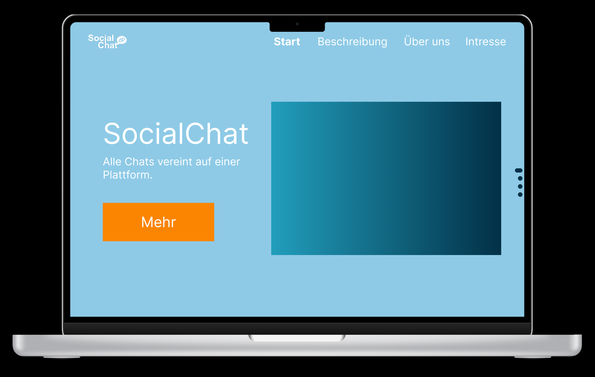
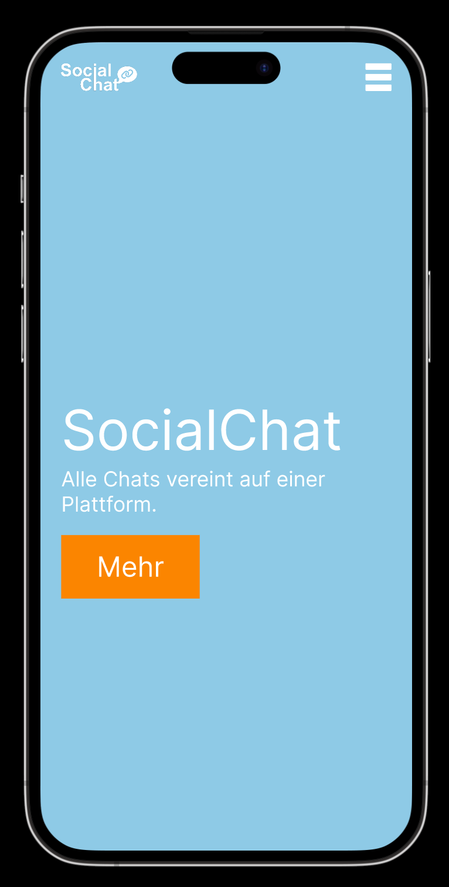

# Storybook - SocialChat
## Inhaltsverzeichnis

- [Inhaltsverzeichnis](#inhaltsverzeichnis)
- [Vorwort](#vorwort)
- [Beschreibung des ePortfolios](#beschreibung-des-eportfolios)
    - [Begründung der Themenwahl](#begründung-der-themenwahl)
- [Visualisierung des ePortfolios](#visualisierung-des-eportfolios)
    - [Farbschemen](#farbschemen)
    - [Navigationsstruktur](#navigationsstruktur)
- [Foto](#foto)
    - [Bearbeitungsdokumentation](#bearbeitungsdokumentation)
    - [Reflexion](#reflexion)
- [Logo](#logo)
    - [Erstellungsdokumentation](#erstellungsdokumentation)
    - [Reflexion](#reflexion-1)
- [Auswahl des Frameworks](#auswahl-des-frameworks)
    - [Begründung](#begründung)

## Vorwort

Ich habe alle Links zum z.B. Prototypen, Storyboard im Markdown-Format, Farbschema, Bilder und noch weitere auf einer öffentlich zugänglichen [Webseite](http://socialchat-linklist.upcraft.li/) zusammengefasst. Ebenfalls sind dort und zur Sicherheit auf [Github](https://github.com/m-mattia-m/M152_ePortfolio/tree/main/storybook/src) alle Versionen der Logos und der bearbeiteten Bilder hinterlegt.

## Beschreibung des ePortfolios

Bei meinem ePortfolio geht es um eine Plattform, in der man verschiedene Social-Media-Kanäle hinzufügen kann. Das Ziel beziehungsweise der Mehrwert besteht darin, dass man die Direct Messages auf einer Plattform verwalten kann und nicht alle Plattformen einzeln öffnen muss. Weiter könnte man verschiedene E-Mail-Adressen hinzufügen wie zum Beispiel info@domain.com, contact@domain.com, billing@domain.com, ... und diese in verschiedene Kategorien einteilen, um es den verschiedenen Teams und Abteilungen zuzuweisen. In unserem Fall würden wir uns aber hauptsächlich auf die vereinheitlichte Beantwortung aller Social-Media-Kanäle fokussieren, da wir dies am einfachsten als SaaS-Lösung anbieten können. Damit wir nicht viel Aufwand für ein Produkt aufwenden, welches niemand benötigt oder möchte, haben wir uns entschieden eine Webseite zu gestalten, auf der man sich bei Interesse eintragen lassen kann, damit wir wissen wie gross das Interesse wäre.

### Begründung der Themenwahl

Ich habe mich für dieses Thema entschieden, da ich lange keine Idee hatte, was ich machen sollte. Nach vielem Überlegen und mit Kollegen sprechen, was ich machen könnte, kam uns die Idee, dass ich etwas für ein Projekt machen könnte, was wir mal geplant haben, da es sich gut für das ePortfolio eignet. Die Vorteile sind, es macht Spass daran zu arbeiten, da es wirklich einen richtigen Zweck hat und nicht "nur" eine Schulaufgabe ist. Weiter habe ich schon gewisse Themen, die ich beschreiben muss.

## Visualisierung des ePortfolios

Der Prototyp kann auf der [Linkliste](https://socialchat-linklist.upcraft.li/) oder über den [Direktlink](https://www.figma.com/file/enmASxtahbNuY0tpAu9Lky/M152_ePortfolio?node-id=0%3A1) aufgerufen werden.

### Farbschemen

Für das Farbschema habe ich zuerst nach einem blauen Farbschema gesucht, da ich blau eine angenehme Farbe finde. Da es dann aber etwas zu blau war, mit dem ersten Farbschema habe ich ein Schema genommen, welches noch orange darin hat. Hier habe ich mich dafür entschieden, dass die Hauptfarben blau sind, also das Menü und der Footer sollen Blau sein. Die Orange Farbe sollte nur als Kontrast dienen, und darum sind die Titel der Texte und der Bestätigen-Button beim Formular in dieser Farbe. Hierbei habe ich noch darauf geachtet, dass der Kontrast der Farben gut ist, welches ich auf einem [Online-Tool](https://www.leserlich.info/kapitel/farben.php) ermittelt habe.

Das Schema kann auf der [Linkliste](https://socialchat-linklist.upcraft.li/) oder über den [Direktlink](https://coolors.co/8ecae6-219ebc-023047-ffb703-fb8500) aufgerufen werden.

### Navigationsstruktur

Die Navigationsstruktur ist ein gewöhnliches Menü, dass aber auf einer One-Page-Seite navigiert. Zur besseren Übersicht habe ich auf der rechten Seite noch eine Step-Navigation eingefügt, auf der man direkt sieht, bei welchem Schritt man aktuell ist. Diese Step-Navigation habe ich auf der Mobile-Version ausgeblendet, da es sonst zu überladen wirkte und nicht genügend Platz dafür auf der Seite gibt. Da die normale Navigation auf Mobile nicht immer funktioniert, da die Seite zu schmal ist, habe ich mich da für ein Hamburger-Menü entschieden, welches man aufklappen kann und dann werden die verschiedenen Bereiche mittig angezeigt, auf die man navigieren kann. Die Navigation wird ist immer oben, auch wenn man scrollt, jedoch ändert es hier die Farbe, da es am Anfang einen schöneren Kontrast gibt.

## Foto

<table>
  <tr>
    <th style="width: 33.3%;"> Original </th>
    <th style="width: 33.3%;"> Bearbeitung </th>
    <th style="width: 33.3%;"> Vergleich </th>
  </tr>
  <tr>
    <td style="width: 33.3%;">
      
    </td>
    <td style="width: 33.3%;">
      
    </td>
    <td style="width: 33.3%;">
      
    </td>
  </tr>
</table>

### Bearbeitungsdokumentation

Ich habe das Bild mit Affinity Photo bearbeitet, da ich privat die Affinity-Programme schon benutzt habe. Zuerst habe ich das mittlere Browserfenster ausgewählt und danach die Auswahl umgekehrt. Dann hatte ich alles aussen herum markiert, welches ich dann mit dem Blur-Filter verschwommen habe. Danach habe ich wieder das mittlere Browserfenster markiert und die Gradationskurve so positioniert, dass die Farben darin intensiver wurden und die Bildschirmspiegelung weg waren. Zum Schluss habe ich noch den Mauszeiger auf dem mittleren Browserfenster, die Lampenreflexionen und das Bild oben Links entfernt. Die Grösse Problematik war das Bild oben links zu entfernen, da es ziemlich gross ist, und es lange benötigte bis die Belichtung dort stimmte und die Lichtreflexion einer Labe auf dem Benachrichtigung-Icon zu entfernen, ohne das Icon selbst zu entfernen. Dazu habe ich das Icon genau ausgeschnitten, weis eingefärbt und als ich das andere Icon komplett entfernt hatte das bearbeitete Icon wieder am richtigen Ort eingefügt.

### Reflexion

Ich fand es schwierig ein Bild zu machen für mein ePortfolio-Thema, da man nicht viel machen konnte. Ich habe deshalb meinen Bildschirm fotografiert, auf dem mehrere Social-Media-Kanäle geöffnet sind, da man alle Kanäle unterhalten muss. Nachdem ich ein paar Bilder hatte, war meine erste Idee den Hintergrund unscharf zu machen. Als ich das hatte, wollte ich das mittlere Fenster stärker in den Fokus setzen und somit die Farben verstärken und die Reflexion vom Bildschirm entfernen. Am Schluss störte mich noch, dass ich vergessen habe den Mauszeiger zu entfernen und habe ihn darum im Bild noch entfernt. Ebenfalls habe ich noch die Lichtreflexionen der Lampen und zwei Fehlermeldungen auf dem TikTok-Messenger entfernt aus dem Bild entfernt.

## Logo

<table>
  <tr>
    <th> 1. Version </th>
    <th> 2. Version </th>
    <th> 3. Version </th>
  </tr>
  <tr>
    <td style="width: 33.3%;">
      
    </td>
    <td style="width: 33.3%;">
      
    </td>
    <td style="width: 33.3%;">
      
    </td>
  </tr>
</table>

### Erstellungsdokumentation

Das Logo habe ich in Affinity Designer gemacht. Hierzu habe ich eine normale Leinwand erstellt, die beiden Wörter 'Social' und 'Chat' voneinander getrennt und übereinander gelegt, hierzu habe ich dann das 'i' und das 'h' der beiden Wörter miteinander verbinden. Später ist mir aufgefallen, dass die Sprechblase, die ich aus früheren Versionen hatte passen würden, wenn es aus dem 't' kommt, hier habe ich dann noch ein Link-Icon eingefügt, welches die Verlinkung der einzelnen Social-Media-Kanäle symbolisieren soll. Die Sprechblase symbolisiert den Chat und die Interaktion auf Social-Media unserer potenziellen Kunden mit ihren Kunden.
### Reflexion

Als erstes Logo habe ich einfach eine Sprechblase mit einem Icon genommen, jedoch fand ich das etwas zu wenig und einfallslos. Danach habe ich mich auf [Logo.com](https://logo.com/) umgesehen,  um mich inspirieren zu lassen, jedoch habe ich bemerkt, dass das Logo, welches ich mit diesen Inspirationen selbst gemacht habe, etwas zu detailliert war und man auf der Webseite kaum erkennen konnte. Deshalb habe ich das Logo nochmals ein drittes Mal neu gemacht. Bei dritten habe ich den Namen auseinander genommen und übereinander gelegt, da habe ich bemerkt, dass ich, dass ich das 'i' und das 'h' miteinander verbinden kann, und dass die Sprechblase aus dem 't' kommen kann.

## Auswahl des Frameworks

Bei der Technologieauswahl habe ich mich auf eine Standard HTML Seite entschieden, welche in NodeJS läuft. Als Style Library habe ich Tailwind ausgewählt. Als JavaScript-Library habe ich AlpineJS benutzt.

### Begründung

Ich habe mich für die Standard HTML Seite entschieden, da es sich für diese Seite gut eignet, da es nicht zu überladen ist. Ich wollte nicht eine komplexere Umgebung wie Angular oder Vue benutzten für eine eher einfachere Webseite. Tailwind als Style Library habe ich ausgewählt, da es aktuell sehr hoch im Kurs ist und ich somit im aktuellen Zeitgeist arbeiten kann. Ein weiterer Vorteil ist, dass nur diese Klassen geladen werden, welche benötigt werden, somit wird das CSS kleiner und die Webseite schneller. Ebenfalls wurde es mir von Kollegen und Freunden empfohlen. Dies habe ich als NodeJS-Umgebung erstellt, da es so am einfachsten war und ich auch einfacher die weiteren Technologien einbinden konnte. Wie zum Beispiel AlpineJS, dies habe ich benutzt, da es eine lightwight-Library ist und die Funktionen deutlich vereinfacht und verschmälert wurden im Gegensatz zu z.B. jQuery. Um die Web-Packages zu generieren habe ich mich für Vite entschieden, da es wie schon die anderen Technologien sehr beliebt ist und viel benutzt wird, somit konnte ich eine viel benutze und moderne Technologie benutzen. Für das Generieren des Web-Package habe ich mich für Vite entschieden, da es wie auch schon bei den anderen Technologien aktuell sehr beliebt ist und ich somit die aktuellen Technologien benutzen konnte. Was auch noch bemerkenswert bei Vite ist, dass es sehr schnell builded und ein Web-Package generiert.
